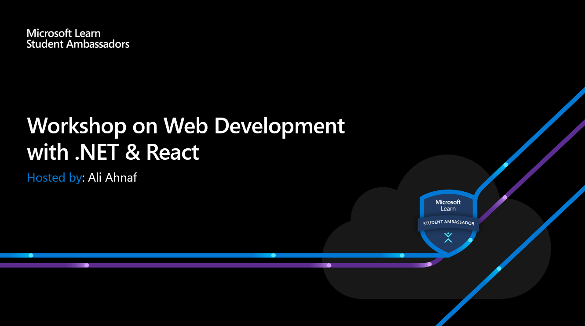

# Microsoft Web Development with .Net Workshop
### Introduce yourself to the world of web development with .Net and React

 

  

 

## :scroll: Event Snippet

This Web Development Workshop is designed to quickly introduce you to developing the backend of a website using Dot Net 5.0 and React. You'll also learn how the internet works, about clients, servers, and protocols. And you'll see the next steps to take yourself to the next level on the web. 

**After completing this workshop, you'll gain the following skills:**

 - Understand how clients and servers work together
 - Create web APIs using [Dotnet](https://dotnet.microsoft.com/)
 - Authenticate users using JWT token
 - Work with NoSQL databases like [MongoDB](https://www.mongodb.com/)
 - Uploading files to Cloud Buckets (namely [UploadCare](https://uploadcare.com/))

## :books: Event Handbook 
### Download the **Exclusive Handbook** and get started with Web Development today!

### Download the **Event Slides**

### The handbook covers- 
* How to setup the environment to start developing with .Net and React
* Complete guide to create a simple blog application 

## 🚀 Learning Resource

Check out [Microsoft Learning Paths](https://docs.microsoft.com/bs-cyrl-ba/learn/dotnet/) learning path on **Microsoft Learn** for in-depth concepts on .NET!

## :movie_camera: Event Recording

[Recording](https://stdntpartners-my.sharepoint.com/:v:/g/personal/ahnaf_ali_studentambassadors_com/EcRur_l-HklAi3QPavZJib0BgOInW42NP9ru6l37LoiVlQ?e=BR6Gz6) Available on **OneDrive**

## :star: Credits
- Speakers : 
	- [Ali Ahnaf](https://github.com/Propo41) (Ambassador)  

----
